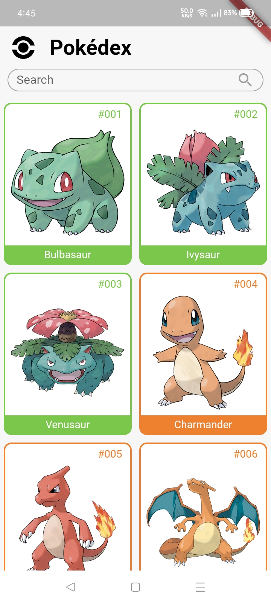
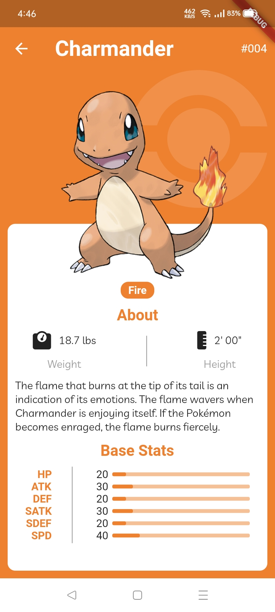
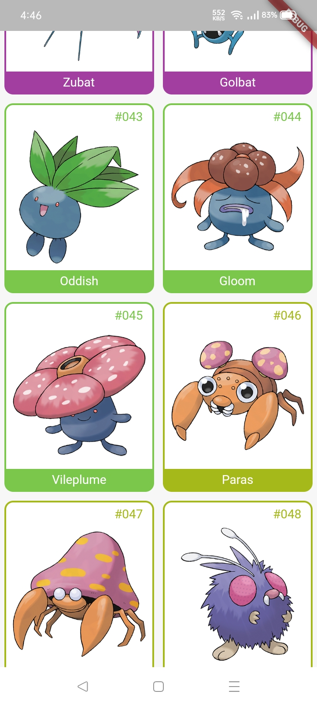
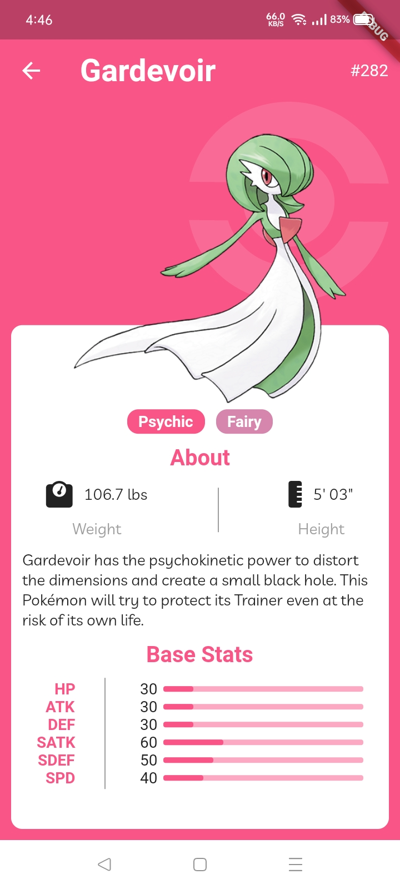

# pokedex_app

This is a pokedex app built using the Flutter Framework and the Bloc library

## Screen Shots

## Installation

Clone the project on your computer. Open a terminal, navigate to the lib folder of the project and run `flutter run -v`

## Thanks 

- [Ricardo Schiniegoski](https://www.figma.com/community/file/979132880663340794) for providing the design from which this app is inspired.
- [MaceGaleon](https://tenor.com/view/pikachu-pokemon-cute-adorable-gif-15757943?utm_source=share-button&utm_medium=Social&utm_content=pinterest) for the pikachu gif 
- [Flutter](https://flutter.dev/) for the awesome framework

